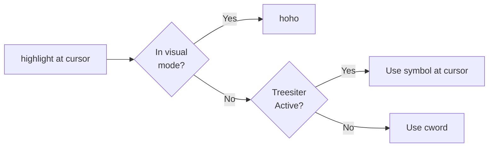

# confetti
Highlight lots of words like it's a party


# Installation

## Using LazyVim

```lua
-- ~/.config/nvim/lua/plugins/confetti.lua
return {
	{
		"imochoa/confetti",
		opts = {
			reused_hlgroups = {},
			colors = {
				{
					guifg = "black",
					guibg = "white",
					altfont = false,
					bold = false,
					inverse = false, -- Inverse will flip fg and bg
					italic = false,
					nocombine = false,
					standout = false,
					strikethrough = false,
					undercurl = false,
					underdashed = false,
					underdotted = false,
					underdouble = false,
					underline = false,
				},
				{ guifg = "black", guibg = "magenta", altfont = true },
				{ guifg = "black", guibg = "lime", bold = true },
				{ guifg = "black", guibg = "yellow", italic = true },
				{ guifg = "black", guibg = "red", nocombine = true },
				{ guifg = "black", guibg = "darkviolet", standout = true },
				{ guifg = "black", guibg = "chocolate", strikethrough = true },
				{ guifg = "black", guibg = "thistle", undercurl = true },
				{ guifg = "black", guibg = "orangered", underdashed = true },
				{ guifg = "black", guibg = "greenyellow", underdotted = true },
				{ guifg = "black", guibg = "acqua", underdouble = true },
				{ guifg = "black", guibg = "hotpink", underline = true },
			},
		},
		keys = {
			{
				"<leader>*",
				function()
					require("confetti").highlight_at_cursor()
				end,
				desc = "Highlight at cursor",
			},
			{
				"<leader>**",
				function()
					require("confetti").clear_highlights()
				end,
				desc = "Clear all confetti highlights",
			},
		},
	},
}
```

## Logic

