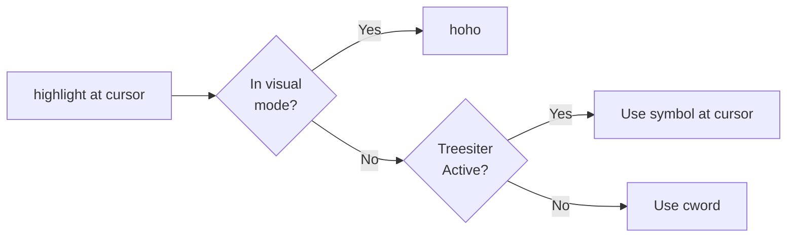

# confetti
Highlight lots of words like it's a party


# Installation

## Using LazyVim

```lua
-- ~/.config/nvim/lua/plugins/confetti.lua
return {
  {
    "imochoa/confetti",
    -- opts = { },
    keys = {
      {
        "<leader>*",
        function()
          require("confetti").highlight_at_cursor()
        end,
        desc = "Highlight at cursor",
      },
      {
        "<leader>**",
        function()
          require("confetti").clear_highlights()
        end,
        desc = "Clear all confetti highlights",
      },
    },
  },
}
```

## Logic

